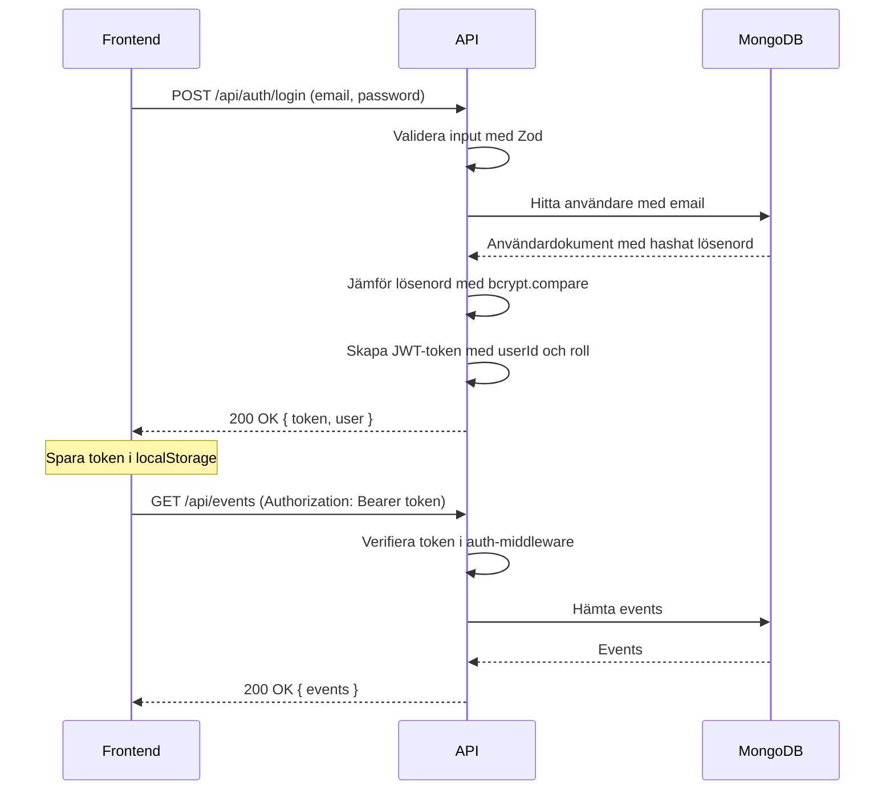
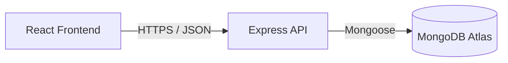
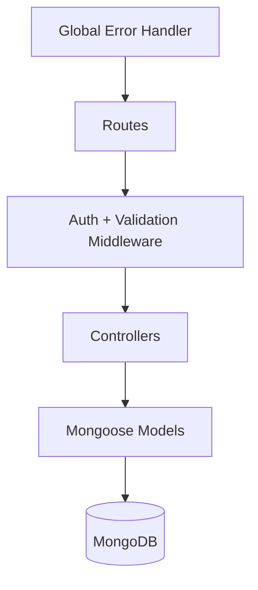

# EventHub

Ett fullstack-system för eventhantering med autentisering, rollbaserad åtkomstkontroll och GDPR-stöd. Byggt med Node.js, Express, MongoDB och React.

---

## Funktioner

- Skapa, redigera, avboka och radera events
- Boka biljetter med stöd för flera biljetttyper och priser
- Automatisk väntelistshantering – när en bokning avbokas befordras nästa i kön
- Recensioner på genomförda events (endast deltagare med bekräftad bokning)
- Kalendervy – events grupperade per dag och månad
- Rollbaserad åtkomstkontroll (RBAC): Admin, Arrangör, Deltagare
- Admin-dashboard med statistik och användarhantering
- GDPR: dataexport och anonymisering av användare

---

## Teknisk stack

| Del | Teknik |
|-----|--------|
| Backend | Node.js 20, Express 4, TypeScript |
| Databas | MongoDB Atlas med Mongoose |
| Validering | Zod |
| Autentisering | JWT (jsonwebtoken) |
| Lösenordshasning | bcryptjs (salt 12) |
| Säkerhetsheaders | Helmet, CORS |
| Frontend | React 18, Vite, TypeScript |
| HTTP-klient | Axios |

---

## Förutsättningar

- Node.js 18 eller senare
- Ett MongoDB Atlas-konto (eller lokal MongoDB)
- Git

---

## Installation

```bash
# 1. Klona repot
git clone https://github.com/oligerta-braholli/Eventhub.git
cd Eventhub

# 2. Installera backend-beroenden
cd backend
npm install

# 3. Skapa miljövariabler
cp .env.example .env
# Fyll i dina egna värden i .env

# 4. Starta backend (utvecklingsläge)
npm run dev

# 5. Öppna ett nytt terminalfönster och installera frontend
cd ../frontend
npm install
npm run dev
```

Backend körs på `http://localhost:3000`  
Frontend körs på `http://localhost:5173`

---

## Miljövariabler

Skapa en `.env`-fil i `backend/`-mappen baserad på `.env.example`:

| Variabel | Beskrivning |
|----------|-------------|
| `NODE_ENV` | Miljö: `development` eller `production` |
| `PORT` | Port för API-servern (standard: 3000) |
| `MONGODB_URI` | Anslutningssträng till MongoDB Atlas |
| `JWT_SECRET` | Hemlig nyckel för JWT-signering — generera med: `node -e "console.log(require('crypto').randomBytes(64).toString('hex'))"` |
| `JWT_EXPIRES_IN` | JWT-tokens livslängd (standard: `7d`) |
| `FRONTEND_URL` | Frontend-URL för CORS (standard: `http://localhost:5173`) |
| `ADMIN_EMAIL` | E-post för admin-kontot (används av `npm run update-admin`) |
| `ADMIN_PASSWORD` | Lösenord för admin-kontot |

**Viktigt:** Commita aldrig `.env`-filen. Den är listad i `.gitignore`.

---

## Användning

### Backend-skript

```bash
npm run dev          # Starta utvecklingsserver med hot reload
npm run build        # Kompilera TypeScript till JavaScript
npm run start        # Starta produktionsserver (kräver build)
npm run seed         # Fyll databasen med testdata
npm run update-admin # Uppdatera admin-kontots e-post och lösenord
```

### Testanvändare (efter npm run seed)

| Roll | E-post | Lösenord |
|------|--------|----------|
| Admin | `admin@eventhub.se` | `Admin1234!` |
| Arrangör | `organizer@eventhub.se` | `Organizer1234!` |
| Deltagare | `anna@example.se` | `Participant1234!` |

---

## API-översikt

Fullständig dokumentation finns i [`backend/ENDPOINTS.md`](backend/ENDPOINTS.md).

| Grupp | Endpoints |
|-------|-----------|
| Autentisering | `POST /api/auth/register`, `POST /api/auth/login`, `GET /api/auth/me` |
| Events | `GET /api/events`, `GET /api/events/calendar`, `POST /api/events`, `PUT /api/events/:id`, `DELETE /api/events/:id` |
| Bokningar | `POST /api/bookings`, `GET /api/bookings/my`, `DELETE /api/bookings/:id` |
| Recensioner | `GET /api/reviews/event/:id`, `POST /api/reviews`, `PATCH /api/reviews/:id`, `DELETE /api/reviews/:id` |
| Väntelistan | `POST /api/waitlist/:eventId`, `DELETE /api/waitlist/:eventId` |
| Admin | `GET /api/admin/stats`, `GET /api/admin/users`, `PATCH /api/admin/users/:id/role` |
| GDPR | `GET /api/gdpr/export`, `DELETE /api/gdpr/anonymize/:userId` |

---

## Autentiseringsflöde



### RBAC – Rollbaserad åtkomstkontroll

| Åtgärd | Deltagare | Arrangör | Admin |
|--------|-----------|----------|-------|
| Se events | ✅ | ✅ | ✅ |
| Boka biljett | ✅ | ✅ | ✅ |
| Skapa event | ❌ | ✅ | ✅ |
| Redigera eget event | ❌ | ✅ | ✅ |
| Radera eget event | ❌ | ✅ | ✅ |
| Radera alla events | ❌ | ❌ | ✅ |
| Admin-dashboard | ❌ | ❌ | ✅ |
| Ändra användarroller | ❌ | ❌ | ✅ |

---

## Systemarkitektur



### Backend-lager



---

## Mappstruktur

```
Eventhub/
├── backend/
│   ├── src/
│   │   ├── config/        # Miljövariabler och databasanslutning
│   │   ├── controllers/   # Affärslogik per resurs
│   │   ├── middleware/    # auth, rbac, validate, errorHandler
│   │   ├── models/        # Mongoose-modeller
│   │   ├── routes/        # Express-routes
│   │   ├── schemas/       # Zod-valideringsscheman
│   │   ├── types/         # TypeScript-typer
│   │   └── utils/         # jwt, errors, gdpr
│   ├── .env.example
│   ├── ENDPOINTS.md
│   └── package.json
└── frontend/
    └── src/
        ├── components/    # Återanvändbara UI-komponenter
        ├── context/       # AuthContext
        ├── pages/         # Sidor (Events, Calendar, Admin osv.)
        ├── services/      # Axios-konfiguration
        └── types/         # TypeScript-typer
```

---

## Säkerhet – OWASP

| Skydd | Implementation |
|-------|---------------|
| Lösenordshasning | bcryptjs med salt-faktor 12 |
| Autentisering | JWT Bearer-token, verifieras i middleware |
| RBAC | `authorize(...roles)` middleware på alla skyddade routes |
| Inputvalidering | Zod-scheman på alla POST/PUT/PATCH-endpoints |
| Säkerhetsheaders | Helmet |
| CORS | Begränsad till frontend-URL via miljövariabel |
| Hemligheter | Alla nycklar och URI:er via `.env`, aldrig i koden |

---

## GDPR och dataminimering

### Personuppgifter som lagras

| Data | Var | Syfte | Åtkomst |
|------|-----|-------|---------|
| Namn | `users.name` | Visas i UI och recensioner | Användaren + admin |
| E-post | `users.email` | Inloggning och identifiering | Användaren + admin |
| Lösenord | `users.password` | Autentisering — hashat med bcrypt, aldrig i klartext | Ingen (`select: false`) |
| Roll | `users.role` | Åtkomstkontroll (RBAC) | Användaren + admin |

### GDPR-endpoints

- `GET /api/gdpr/export` — exporterar all data kopplad till inloggad användare
- `DELETE /api/gdpr/anonymize/:userId` — anonymiserar namn, e-post och all kopplad data

### Loggningspolicy

Vi loggar: HTTP-metod, sökväg, statuskod, svarstid  
Vi loggar **aldrig**: lösenord, e-postadresser, request body, Authorization-headers

---

## Kända begränsningar

- Ingen e-postnotifikation vid bokning eller väntelistsbefordran
- Ingen betalningsintegration (biljetter kan ha pris men ingen faktisk betalning sker)
 
---

## Författare

Oligerta Braholli — Chas Academy  
Kurs: Backendutveckling i Node.js, databaser och säkerhet
